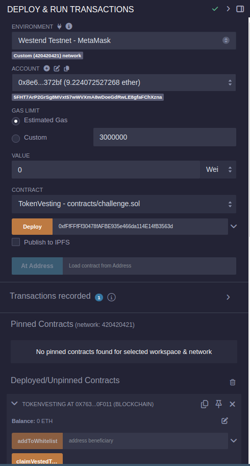
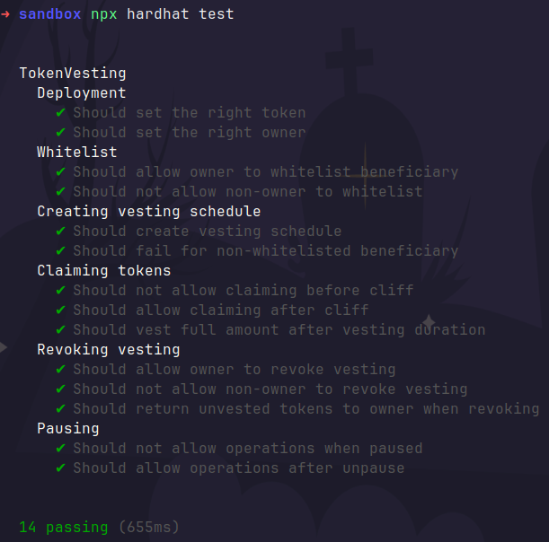

# OpenHack Vesting Contract

This challenge involves creating a smart contract for token vesting with configurable schedules. You'll learn about time-based operations, token handling, and access control in Solidity.

## 🎯 Challenge Overview

Create a token vesting contract that allows an admin to:
- Create vesting schedules for beneficiaries
- Configure cliff periods and vesting durations
- Revoke unvested tokens
- Allow beneficiaries to claim their vested tokens

## 🚀 Getting Started

### Prerequisites
- [Remix IDE](https://remix.ethereum.org/)
- MetaMask or another web3 wallet
- Connect to Asset Hub Westend Testnet:

```bash
  - Network name: Asset-Hub Westend Testnet 
  - RPC URL URL: `https://westend-asset-hub-eth-rpc.polkadot.io` 
  - Chain ID: `420420421` - Currency Symbol: `WND` - Block Explorer URL: `https://assethub-westend.subscan.io`
```

- Request Westend tokens from the [Westend Faucet](https://faucet.polkadot.io/westend?parachain=1000).

### Local development environment setup

```bash
git clone git@github.com:NTP-996/open-hack-vesting.git
cd open-hack-vesting
npm i
```

> **_NOTE:_**  For deployment, you may experience some issue deploying with hardhat, you can put your code on [remix](https://remix.polkadot.io/) to deploy

### Setup Steps

1. **Create the Test Token**
```solidity
// TestToken.sol
// SPDX-License-Identifier: MIT
pragma solidity ^0.8.0;

import "@openzeppelin/contracts/token/ERC20/ERC20.sol";

contract TestToken is ERC20 {
    constructor() ERC20("Test Token", "TEST") {
        _mint(msg.sender, 1000000 * 10**decimals());
    }
}
```

2. **Deploy the Contracts**
   - Open Remix IDE
   - Create two files: `TestToken.sol` and `TokenVesting.sol`
   - Paste the challenge code into `TokenVesting.sol`
   - Compile both contracts
   - Deploy `TestToken` first
   - Deploy `TokenVesting` using the TestToken address as constructor parameter
   - A successful deployment should look like this:

     

3. **Test Setup**
   - Approve the TokenVesting contract to spend your tokens:
     ```solidity
     // On TestToken contract
     approve(VESTING_CONTRACT_ADDRESS, 1000000 * 10**18)
     ```

## 🧪 Test Cases

```bash
npx hardhat compile
npx hardhat test
```

### All of your test should pass



## 📋 Validation Checklist

- [ ] Contract compiles without warnings
- [ ] All functions have proper access control
- [ ] Events are emitted correctly
- [ ] Time calculations are accurate
- [ ] Token transfers succeed
- [ ] Revocation works as expected
- [ ] No funds can be locked permanently

## 🔍 Common Issues

1. **Time Calculations**: Make sure to handle timestamps correctly and consider block.timestamp precision
2. **Token Decimals**: Remember to account for token decimals in calculations
3. **Rounding**: Be careful with division operations and potential rounding issues
4. **Gas Optimization**: Consider gas costs in loops and calculations

## 🎉 Success Criteria

Your implementation should:
1. Pass all test cases
2. Handle edge cases gracefully
3. Emit appropriate events
4. Maintain accurate token accounting
5. Implement proper access control
6. Include comprehensive input validation

Good luck with the challenge! 🚀

---
